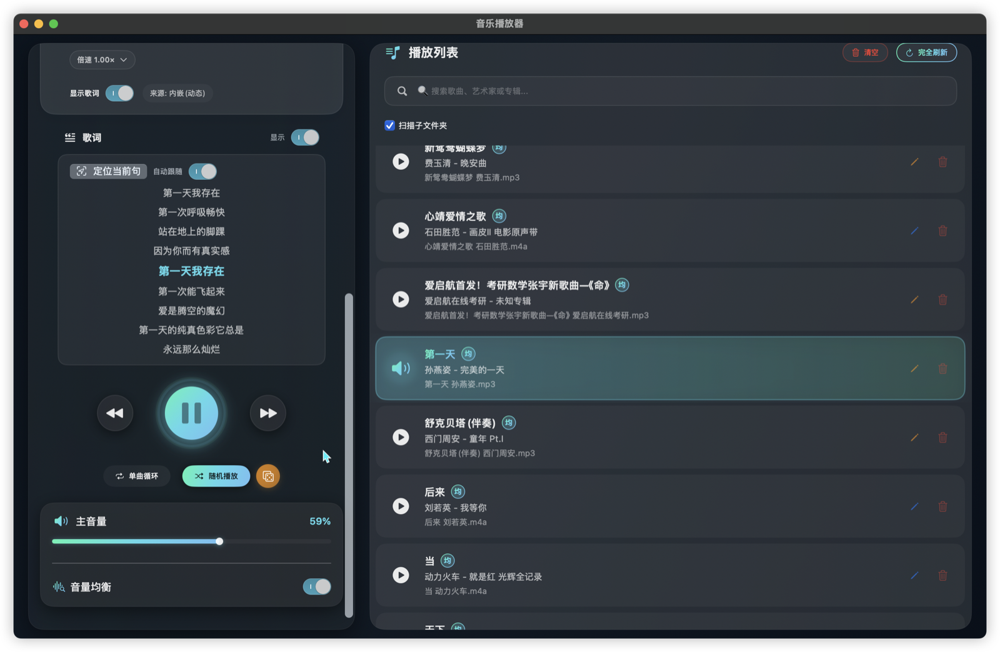
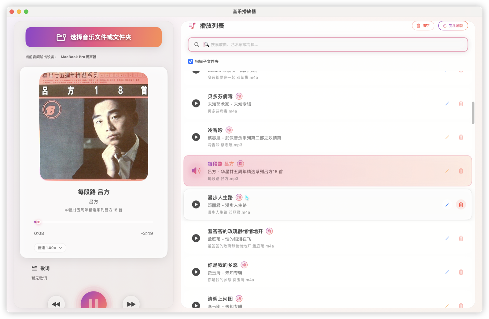
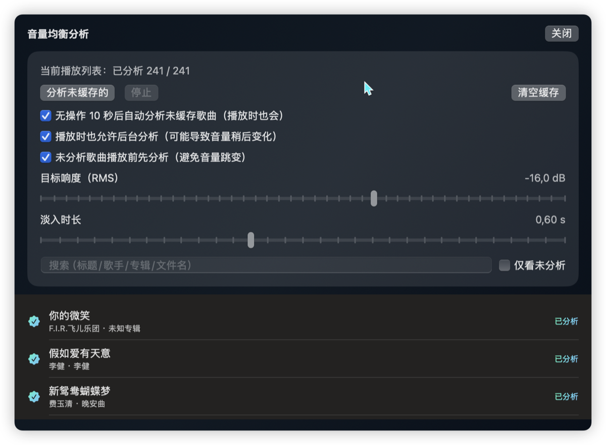

  
  <h1>MusicPlayer for macOS</h1>
  
一款基于 SwiftUI 与 AVFoundation 的本地音乐播放器

  

    <a href="https://github.com/lueluelue2006/macOS_MusicPlayer/releases">下载（Releases）</a>
    ·
    <a href="LLM_README.md">开发与调试（LLM_README）</a>
  

特性：
- 拖拽添加歌曲/文件夹 + 播放列表
- 随机/循环、断点续播
- 随机权重（队列/歌单独立）
- 音量均衡（响度分析缓存）
- 歌词显示（内嵌/外置 `.lrc`）
- 基础元数据编辑

## 下载（DMG）

- GitHub Releases: https://github.com/lueluelue2006/macOS_MusicPlayer/releases
- 选择对应架构的 DMG：
  - Apple Silicon：`MusicPlayer-vX.Y.dmg`
  - Intel：`MusicPlayer-vX.Y-intel.dmg`

## 使用

- 拖拽本地音乐文件/文件夹到窗口即可添加到播放列表。
- 支持随机/循环/断点续播/歌词显示/响度分析等功能。

## 版本号（Versioning）

- 小更新：`x.y.(z+1)`（例如 `3.6 → 3.6.1`）
- 较大更新：`x.(y+1)`（例如 `3.6 → 3.7`）

## 致歉（/Applications 备份目录）

在 **v3.4 及更早版本**中，自动更新为了降低覆盖失败风险，会在 `/Applications` 下留下旧版本备份目录（例如 `MusicPlayer.app.bak-update-*`）。这会让应用目录显得杂乱，对此非常抱歉。

从 **v3.6** 起，更新会直接覆盖安装（不会再在 `/Applications` 留下 `bak-update` 之类的备份目录；旧版本可在 GitHub Releases 重新下载）。若你之前已产生备份目录，可手动删除这些 `MusicPlayer.app.bak*` 文件夹。

提示：如果你是从 **v3.4 / v3.5** 自动更新到更高版本，这一次仍可能留下一个备份目录（由旧版本更新脚本创建）；升级到 v3.6 后，后续更新不会再留下。

## 随机权重（Weighted Random）

每首歌都可以设置一个“随机权重”（5 档）。权重只影响**随机/洗牌**（例如随机播放/骰子），不影响顺序播放。

|档位|颜色|倍数|
|---:|---|---:|
|1|绿色|1.0×|
|2|蓝色|1.6×|
|3|紫色|3.2×|
|4|金色|4.8×|
|5|红色|6.4×|

计算方式：
- **随机（单次抽样）**：每首歌被选中的概率 `P(i) = wᵢ / Σw`（轮盘赌/roulette 选择）。
- **洗牌（无放回随机序列）**：使用 Efraimidis–Spirakis 加权洗牌：对每首歌生成 `k = -ln(u) / w`（`u∈(0,1]`），按 `k` 从小到大排序得到播放顺序；权重越高越倾向靠前，但仍然是随机的。
- **新增歌曲插入洗牌队列**：为避免重洗导致“当前播放跳动”，新加入的曲目会按权重插入到剩余洗牌队列中（权重越高越靠前的概率越大）。

持久化与范围：
- 权重按文件路径持久化保存（默认 1.0× 不会写入，只保存“非默认覆盖”）。
- **队列权重**与**歌单权重**相互独立；歌单侧栏提供“同步权重”按钮，可将当前歌单的权重覆盖同步到队列。

## 隐私

- 应用不上传你的音乐数据；仅在“检查更新”时会访问 GitHub（获取最新版本信息）。

## 开发与调试

- CLI/IPC/构建与代码地图等内容见：`LLM_README.md`

## Bundle ID（UserDefaults 域）

- `io.github.lueluelue2006.macosmusicplayer`

## License

GNU AGPLv3（见 `LICENSE`）。

## 预览图

