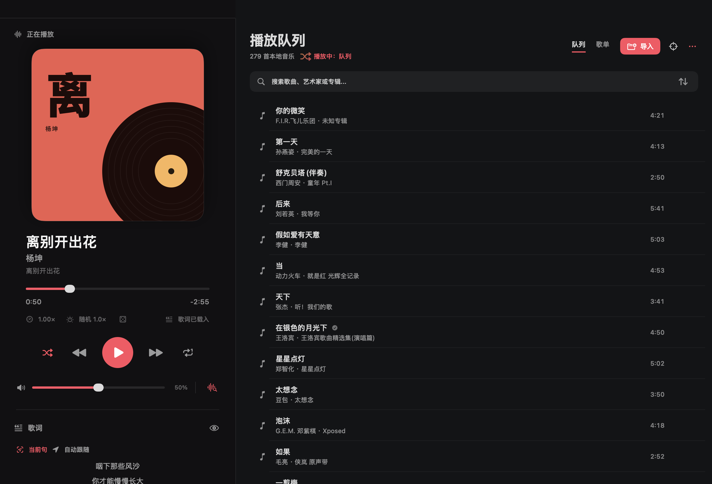
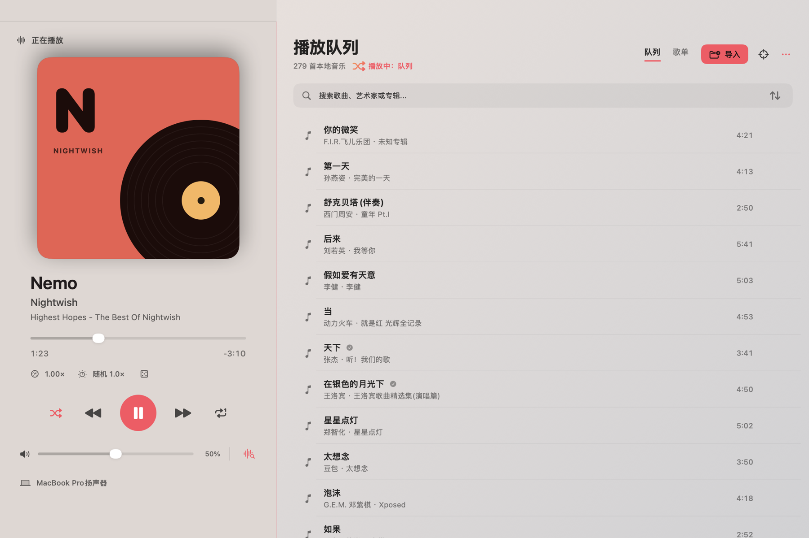
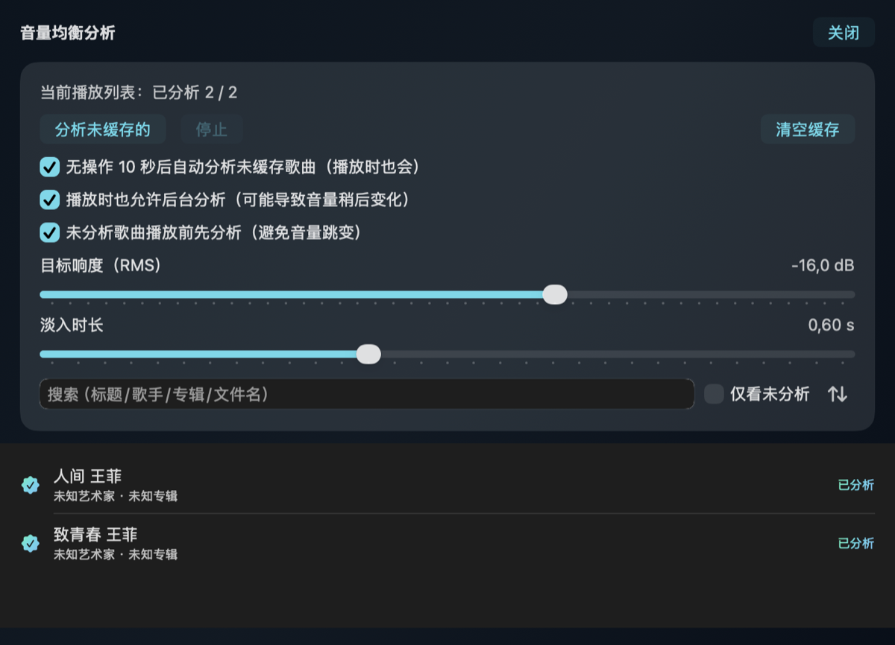

<div align="center">
  
  <h1>MusicPlayer for macOS</h1>
  <p>本地、离线优先的 macOS 音乐播放器。</p>
  <p>
    <a href="https://github.com/lueluelue2006/macOS_MusicPlayer/releases">下载 Releases</a>
    ·
    <a href="LLM_README.md">开发者说明</a>
  </p>
</div>

## 它是什么

MusicPlayer 是一个用 SwiftUI 和 AVFoundation 写的 macOS 本地音乐播放器。它不做云同步，不上传音乐库，以唱片封面为播放视觉中心，同时把本地文件播放、歌单、歌词、响度分析和随机权重这些日常功能做得直接、稳定。

## 主要功能

- 拖拽添加音乐文件或文件夹
- 队列播放和自定义歌单
- 随机播放与单曲循环二选一
- 可选的沉浸播放，自动跳过歌曲首尾静音并缩短切歌等待
- 断点恢复和当前播放定位
- 内嵌歌词与外置 `.lrc` 歌词
- 音量均衡分析与缓存
- 基础元数据编辑
- 每首歌独立随机权重
- `musicplayerctl` CLI 自动化控制

支持常见音频格式：`mp3`、`m4a`、`aac`、`wav`、`aif`、`aiff`、`aifc`、`caf`、`flac`。

## 安装

当前发行版仅支持 Apple Silicon（M 系列 Mac）。从 [GitHub Releases](https://github.com/lueluelue2006/macOS_MusicPlayer/releases) 下载 `MusicPlayer-vX.Y.Z.dmg`。

打开 DMG 后，把 `MusicPlayer.app` 拖进 `Applications`。如果首次打开被 macOS 拦截，可以在“系统设置 → 隐私与安全性”里允许打开，或执行：

```bash
xattr -dr com.apple.quarantine /Applications/MusicPlayer.app
```

## 使用

打开应用后，把音乐文件或文件夹拖进窗口即可。队列适合临时播放，歌单适合长期整理。歌单和队列各自有独立的随机权重；在歌单里设置好权重后，可以用“同步权重给队列”把非默认权重同步过去。

播放控制栏左侧用二选一控件在随机播放和单曲循环之间切换，始终保留一种播放方式。搜索框支持按歌曲名、艺术家、专辑和文件名过滤。歌曲行标题旁的灰色对勾表示该曲目已经完成音量均衡分析；随机权重和编辑操作在悬停时出现，也可以通过右键菜单访问。正在播放区域始终显示六个权重方块，歌曲行菜单同时显示档位和倍率。

## 沉浸播放

在播放控制栏点击 `∞` 可以开启沉浸播放。v3 边界检测只读取每首歌曲开头和结尾各最多 30 秒，结合每曲自适应的尾部相对响度、持续可听窗口和衰减形态寻找边界；静音之后偶发的孤立噪点不会再把结尾向后拖，持续稳定的轻声尾奏则会被保留。结果缓存后会在播放时跳过确认过的首尾静音，音乐文件本身不会被裁剪、重写或删除。

播放器只分析当前歌曲和预加载的下一首，并复用已经写入的边界缓存，不会默认扫描整套曲库造成持续 CPU 与内存负载。无法可靠判断边界时会保守地完整播放原曲。这个模式用于让相邻歌曲更快接上，不承诺压缩格式下的采样级无缝播放。

## 音量均衡与资源使用

全新安装默认开启音量均衡和闲置分析，关闭“播放时分析”和“播放前等待分析”。系统连续闲置 60 秒后，播放器每批最多分析 2 首；其他应用中的输入会在监测到后暂停，播放器内操作、开始播放、进入低电量模式或系统温度离开 nominal 状态会立即停止当前自动批次。整曲 RMS 分析共用一个串行 `.utility` 任务，手动批量分析也沿用这个通道，不会并发解码多首歌曲。

缓存只保存响度结果、文件大小、修改时间和文件标识，不保存解码后的 PCM。它限制为最多 5,000 项和约 8 MiB，同一路径文件被替换后会自动失效；连续更新会合并写盘，并在退出时强制刷新。这样可以用少量磁盘缓存换取后续播放零分析开销，又不会让内存、CPU 或 JSON 无限增长。

## 队列恢复

队列恢复只保存文件路径和当前索引。连续切歌或增删会合并为约 0.4 秒后的最新快照并原子写入，应用退出时立即刷新，因此常规操作不会每次同步写盘，也不会在内存里积压多份完整队列。

## 随机权重

随机权重只影响随机播放、洗牌和骰子选择；切到单曲循环时，它不会影响当前歌曲的重复播放。

权重共有六档；界面按第 1 到第 6 档显示，CLI/API 的内部编号仍为 `0` 到 `5`。每首未单独设置的歌曲默认使用第 2 档（`1.0×`），不会写入权重缓存。可以从歌曲行、右键菜单或正在播放区域常驻的六个方块中选择更低或更高的出现概率。

| 界面档位 | CLI/API 编号 | 倍数 |
|---:|---:|---:|
| 第 1 档 | 0 | 0.5× |
| 第 2 档（默认） | 1 | 1.0× |
| 第 3 档 | 2 | 1.6× |
| 第 4 档 | 3 | 3.2× |
| 第 5 档 | 4 | 4.8× |
| 第 6 档 | 5 | 6.4× |

随机抽样使用权重比例选择；洗牌使用无放回的加权随机序列。权重按文件路径保存，队列权重和歌单权重互相独立。

## CLI

应用启动后，可以用 bundle 里的 CLI 控制它：

```bash
/Applications/MusicPlayer.app/Contents/MacOS/musicplayerctl ping
/Applications/MusicPlayer.app/Contents/MacOS/musicplayerctl status --json
/Applications/MusicPlayer.app/Contents/MacOS/musicplayerctl play --index 0
/Applications/MusicPlayer.app/Contents/MacOS/musicplayerctl seek 2:30
/Applications/MusicPlayer.app/Contents/MacOS/musicplayerctl weight get --current
/Applications/MusicPlayer.app/Contents/MacOS/musicplayerctl screenshot --out /tmp/musicplayer.png
```

开发构建后的 CLI 也可以从 `.build/release/musicplayerctl` 使用。

## 开发

需要 macOS 13+ 和 Xcode Command Line Tools。

```bash
swift test --jobs 1
swift build --jobs 1
./build.sh
open MusicPlayer.app
```

常用产物：

- `MusicPlayer.app`：`./build.sh` 生成的本机 app
- `.build/release/musicplayerctl`：CLI
- `MusicPlayer-v<version>.dmg`：`./create_dmg.sh` 生成的 DMG

更多代码地图、IPC、缓存和调试信息见 [LLM_README.md](LLM_README.md)。

## 数据与隐私

MusicPlayer 不上传你的音乐文件、歌词、队列或播放列表。应用只会在检查更新时访问 GitHub Releases。

主要本地数据在：

```text
~/Library/Application Support/MusicPlayer
```

里面包含队列与播放列表、元数据缓存、歌词/封面、整曲 RMS 响度缓存和沉浸播放首尾边界缓存等本地文件。

Bundle ID：

```text
io.github.lueluelue2006.macosmusicplayer
```

## License

GNU AGPLv3。详见 [LICENSE](LICENSE)。

## 截图






